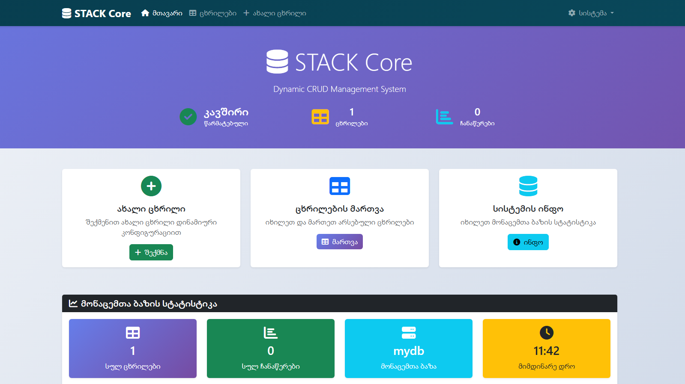

# STACK Core 🚀

<div align="center">
  
  
  
  
  
</div>



<div align="center">
  <h3>Dynamic CRUD Management System</h3>
  <p>პროფესიონალური დინამიური მონაცემთა ბაზის მართვის სისტემა</p>
  <p><strong>🌐 <a href="https://stack.ge/">https://stack.ge/</a></strong></p>
</div>

DEMO: https://dcrudms.stack.ge/

---

## 📋 სარჩევი

- [🎯 რა არის STACK Core](#-რა-არის-stack-core)
- [✨ ძირითადი ფუნქციები](#-ძირითადი-ფუნქციები)
- [🔧 სისტემის მოთხოვნები](#-სისტემის-მოთხოვნები)
- [📦 ინსტალაცია](#-ინსტალაცია)
- [⚙️ კონფიგურაცია](#️-კონფიგურაცია)
- [🚀 გამოყენება](#-გამოყენება)
- [📁 ფაილების სტრუქტურა](#-ფაილების-სტრუქტურა)
- [🔐 უსაფრთხოება](#-უსაფრთხოება)
- [🎨 UI/UX ფუნქციები](#-uiux-ფუნქციები)
- [📖 API დოკუმენტაცია](#-api-დოკუმენტაცია)
- [🤝 წვლილი](#-წვლილი)
- [📝 ლიცენზია](#-ლიცენზია)
- [👨‍💻 ავტორი](#-ავტორი)

---

## 🎯 რა არის STACK Core

**STACK Core** არის თანამედროვე, დინამიური CRUD (Create, Read, Update, Delete) მართვის სისტემა, რომელიც შექმნილია PHP-ზე და MySQL მონაცემთა ბაზაზე. სისტემა ავტომატურად ამოიცნობს მონაცემთა ბაზის ცხრილებს და უზრუნველყოფს სრული ფუნქციონალის მქონე ვებ ინტერფეისს მონაცემების მართვისთვის.

### 🌟 რატომ STACK Core?

- **🔄 100% დინამიური**: ყველა ცხრილი ავტომატურად ამოიცნობა
- **⚡ ზერო კონფიგურაცია**: არ სჭირდება დამატებითი setup-ი
- **📱 Responsive Design**: მუშაობს ყველა მოწყობილობაზე
- **🔒 უსაფრთხო**: SQL Injection და CSRF დაცვა
- **🎨 თანამედროვე UI**: Bootstrap 5 + Font Awesome
- **🇬🇪 ქართული**: სრული ქართული ლოკალიზაცია

---

## ✨ ძირითადი ფუნქციები

### 📊 CRUD ოპერაციები
- ✅ **Create** - ახალი ჩანაწერების დამატება
- ✅ **Read** - მონაცემების ნახვა pagination და filtering-ით
- ✅ **Update** - ჩანაწერების რედაქტირება
- ✅ **Delete** - უსაფრთხო წაშლა confirmation-ით

### 🗄️ ცხრილების მართვა
- 🔍 ავტომატური ცხრილების ამოცნობა
- 📊 რეალურ დროში სტატისტიკა
- 🏗️ ახალი ცხრილების შექმნა Visual Editor-ით
- 🔗 Primary Key და Foreign Key მხარდაჭერა
- 📋 ცხრილების სტრუქტურის ანალიზი

### 🔍 ძიება და ფილტრაცია
- 🔎 Global Search ყველა ველში
- 📑 Pagination დიდი მონაცემებისთვის
- 🔄 Sorting ყველა სვეტზე
- 🎯 Advanced Filtering

### 🎨 UI/UX
- 📱 Responsive Bootstrap 5 Design
- 🌙 Professional Dark Theme
- 🎉 SweetAlert2 Notifications
- 📊 Interactive Dashboards
- 🚀 Fast Loading

---

## 🔧 სისტემის მოთხოვნები

### მინიმალური მოთხოვნები:
- **PHP**: 7.4 ან უფრო ახალი
- **MySQL**: 5.7 ან MariaDB 10.2+
- **Web Server**: Apache/Nginx
- **Extensions**: PDO, PDO_MySQL, mbstring, json

### რეკომენდებული:
- **PHP**: 8.1+
- **MySQL**: 8.0+
- **Memory**: 128MB+
- **Disk Space**: 50MB

---

## 📦 ინსტალაცია

### 1️⃣ ფაილების გადმოწერა

```bash
# Git Repository-დან
git clone https://github.com/skryper/stack-core.git
cd stack-core

# ან ZIP ფაილის გამოყენებით
wget https://github.com/skryper/stack-core/archive/main.zip
unzip main.zip
```

### 2️⃣ Web Server-ზე განთავსება

```bash
# Apache/Nginx document root-ში კოპირება
sudo cp -r stack-core/* /var/www/html/

# უფლებების მინიჭება
sudo chown -R www-data:www-data /var/www/html/
sudo chmod -R 755 /var/www/html/
```

### 3️⃣ მონაცემთა ბაზის შექმნა

```sql
-- MySQL-ში შექმენით ახალი ბაზა
CREATE DATABASE stack_core CHARACTER SET utf8mb4 COLLATE utf8mb4_unicode_ci;

-- მომხმარებლის შექმნა (არასავალდებულო)
CREATE USER 'stack_user'@'localhost' IDENTIFIED BY 'secure_password';
GRANT ALL PRIVILEGES ON stack_core.* TO 'stack_user'@'localhost';
FLUSH PRIVILEGES;
```

---

## ⚙️ კონფიგურაცია

### მთავარი კონფიგურაცია: `config/db.php`

```php
<?php
// Database Configuration
define('DB_HOST', 'localhost');           // MySQL სერვერის მისამართი
define('DB_NAME', 'stack_core');          // მონაცემთა ბაზის სახელი
define('DB_USER', 'stack_user');          // მომხმარებლის სახელი
define('DB_PASS', 'secure_password');     // პაროლი
define('DB_CHARSET', 'utf8mb4');          // სიმბოლოების კოდირება

// Application Configuration
define('APP_NAME', 'STACK Core');         // აპლიკაციის სახელი
define('APP_VERSION', '1.0.0');           // ვერსია
define('APP_AUTHOR', 'By Skryper');       // ავტორი
define('APP_WEBSITE', 'https://stack.ge/'); // ვებსაიტი

// Security Configuration
define('SESSION_TIMEOUT', 3600);          // Session timeout (წამებში)
define('CSRF_TOKEN_NAME', '_token');      // CSRF token-ის სახელი

// UI Configuration
define('RECORDS_PER_PAGE', 20);           // გვერდზე ჩანაწერების რაოდენობა
define('MAX_RECORDS_PER_PAGE', 100);      // მაქსიმალური რაოდენობა
?>
```

### 🔧 დამატებითი კონფიგურაცია

#### Error Reporting (Development)
```php
// Development Environment-ისთვის
error_reporting(E_ALL);
ini_set('display_errors', 1);

// Production Environment-ისთვის
error_reporting(0);
ini_set('display_errors', 0);
ini_set('log_errors', 1);
ini_set('error_log', '/path/to/error.log');
```

---

## 🚀 გამოყენება

### 1️⃣ სისტემაში შესვლა

1. გახსენით ბრაუზერი და გადადით: `http://yourdomain.com/public/`
2. თუ კონფიგურაცია სწორია, გამოჩნდება STACK Core მთავარი გვერდი
3. კავშირის სტატუსი უნდა იყოს "წარმატებული"

### 2️⃣ ცხრილების მართვა

#### ახალი ცხრილის შექმნა:
1. გადადით **"ცხრილები"** → **"ახალი ცხრილი"**
2. შეიყვანეთ ცხრილის სახელი
3. დაამატეთ სვეტები კონფიგურაციით:
   - სახელი (მაგ: `username`)
   - ტიპი (მაგ: `VARCHAR`)
   - სიგრძე (მაგ: `50`)
   - თვისებები (NULL, PRIMARY KEY, AUTO_INCREMENT)

#### შაბლონების გამოყენება:
- **👥 მომხმარებლები**: id, username, email, password, created_at
- **📦 პროდუქტები**: id, name, description, price, category, in_stock

### 3️⃣ მონაცემების მართვა

#### ჩანაწერის დამატება:
1. აირჩიეთ ცხრილი
2. დააწკაპუნეთ **"ჩანაწერის დამატება"**
3. შეავსეთ ველები
4. დააწკაპუნეთ **"შენახვა"**

#### ძიება და ფილტრაცია:
- გამოიყენეთ ძიების ველი Global Search-ისთვის
- დააწკაპუნეთ სვეტების სათაურებზე Sorting-ისთვის
- შეცვალეთ გვერდზე ჩანაწერების რაოდენობა

---

## 📁 ფაილების სტრუქტურა

```
stack-core/
├── 📁 config/
│   └── 📄 db.php                 # მთავარი კონფიგურაცია
├── 📁 core/
│   ├── 📄 DatabaseManager.php    # მონაცემთა ბაზის მართვა
│   ├── 📄 UIHelper.php          # UI კომპონენტები
│   └── 📄 actions.php           # CRUD მოქმედებები
├── 📁 public/
│   ├── 📄 index.php             # მთავარი დაშბორდი
│   ├── 📄 tables.php            # ცხრილების სია
│   └── 📄 create.php            # ცხრილის შექმნა
├── 📁 views/
│   └── 📄 view_table.php        # ცხრილის ნახვა/რედაქტირება
├── 📁 includes/
│   ├── 📄 header.php            # საერთო Header
│   └── 📄 footer.php            # საერთო Footer
├── 📁 auth/                     # Authentication (მომავალი)
├── 📁 modules/                  # დამატებითი მოდულები
├── 📁 templates/                # Custom თემები
├── 📄 README.md                 # ეს ფაილი
├── 📄 LICENSE                   # ლიცენზია
└── 📄 .htaccess                # Apache კონფიგურაცია
```

---

## 🔐 უსაფრთხოება

### 🛡️ დაცვის მექანიზმები

#### SQL Injection დაცვა:
```php
// ✅ უსაფრთხო - PDO Prepared Statements
$stmt = $pdo->prepare("SELECT * FROM users WHERE id = ?");
$stmt->execute([$userId]);

// ❌ არასაფრთხო - Direct Query
$query = "SELECT * FROM users WHERE id = " . $_GET['id'];
```

#### CSRF დაცვა:
```php
// Token-ის გენერირება
$token = generateCSRFToken();

// Validation
if (!validateCSRFToken($_POST['_token'])) {
    die('CSRF Token Invalid');
}
```

#### Session Security:
```php
// Session Timeout
if (isset($_SESSION['last_activity']) && 
    (time() - $_SESSION['last_activity'] > SESSION_TIMEOUT)) {
    session_destroy();
}
```

### 🔒 რეკომენდაციები

1. **Strong Passwords**: გამოიყენეთ ძლიერი პაროლები
2. **HTTPS**: Production-ზე აუცილებლად HTTPS
3. **Regular Updates**: რეგულარულად განაახლეთ PHP და MySQL
4. **Backup**: რეგულარული სარეზერვო კოპირება
5. **Access Control**: შეზღუდეთ წვდომა `/config/` დირექტორიაზე

---

## 🎨 UI/UX ფუნქციები

### 🎯 Design System

#### ფერების პალიტრა:
```css
:root {
    --stack-primary: #667eea;     /* მთავარი ფერი */
    --stack-secondary: #764ba2;   /* დამატებითი ფერი */
    --stack-success: #06d6a0;     /* წარმატება */
    --stack-info: #118ab2;        /* ინფორმაცია */
    --stack-warning: #ffd166;     /* გაფრთხილება */
    --stack-danger: #ef476f;      /* შეცდომა */
    --stack-dark: #073b4c;        /* მუქი */
}
```

#### Responsive Breakpoints:
- 📱 Mobile: < 768px
- 📱 Tablet: 768px - 1024px
- 💻 Desktop: > 1024px

### 🚀 JavaScript Features

#### SweetAlert2 Notifications:
```javascript
// წარმატების შეტყობინება
showSuccess('ოპერაცია წარმატებით დასრულდა!');

// შეცდომის შეტყობინება
showError('მოხდა შეცდომა!');

// დადასტურების მოთხოვნა
confirmAction('დარწმუნებული ხართ?', function() {
    // Action callback
});
```

---

## 📖 API დოკუმენტაცია

### 🔧 Core Classes

#### DatabaseManager Class

```php
// ობიექტის შექმნა
$dbManager = new DatabaseManager($pdo);

// ცხრილების მიღება
$tables = $dbManager->getTables();

// ცხრილის ინფორმაცია
$info = $dbManager->getTableInfo('users');

// ჩანაწერების მიღება
$result = $dbManager->getRecords('users', [
    'page' => 1,
    'limit' => 20,
    'search' => 'john',
    'order_by' => 'created_at',
    'order_dir' => 'DESC'
]);

// ჩანაწერის დამატება
$result = $dbManager->insertRecord('users', [
    'username' => 'john_doe',
    'email' => 'john@example.com'
]);

// ჩანაწერის განახლება
$result = $dbManager->updateRecord('users', $id, [
    'username' => 'john_updated'
]);

// ჩანაწერის წაშლა
$result = $dbManager->deleteRecord('users', $id);
```

#### UIHelper Class

```php
// Header-ის გენერირება
echo UIHelper::getHeader('Page Title');

// Navigation-ის გენერირება
echo UIHelper::getNavbar('current_page');

// Alert-ის გენერირება
echo UIHelper::showAlert('Message', 'success');

// Pagination-ის გენერირება
echo UIHelper::getPagination($page, $totalPages, $baseUrl);

// Footer-ის გენერირება
echo UIHelper::getFooter();
```

---

## 🤝 წვლილი

STACK Core არის ღია კოდის პროექტი და ვთანხმობით ყველა წვლილს!

### 🔧 Development Setup

```bash
# Repository-ს ჩამოწერა
git clone https://github.com/skryper/stack-core.git
cd stack-core

# Development branch-ზე გადასვლა
git checkout -b feature/new-feature

# ცვლილებების გაკეთება
# ...

# Commit და Push
git add .
git commit -m "Add new feature"
git push origin feature/new-feature

# Pull Request-ის შექმნა
```

### 📋 Contribution Guidelines

1. **Code Style**: PSR-12 სტანდარტის გაყოლა
2. **Comments**: კომენტარები ქართულ ენაზე
3. **Testing**: ყველა ახალი ფუნქციისთვის ტესტების დაწერა
4. **Documentation**: README.md-ს განახლება ახალი ფუნქციებისთვის

### 🐛 Bug Reports

შეცდომების შესახებ მოგვახსენეთ: [GitHub Issues](https://github.com/skryper/stack-core/issues)

**შეცდომის რეპორტი უნდა შეიცავდეს:**
- სისტემის ვერსია
- PHP ვერსია
- ნაბიჯები რეპროდუქციისთვის
- მოსალოდნელი და ფაქტიური შედეგი
- სკრინშოტები (თუ საჭიროა)

---

## 📝 ლიცენზია

```
MIT License

Copyright (c) 2025 Skryper (https://stack.ge/)

Permission is hereby granted, free of charge, to any person obtaining a copy
of this software and associated documentation files (the "Software"), to deal
in the Software without restriction, including without limitation the rights
to use, copy, modify, merge, publish, distribute, sublicense, and/or sell
copies of the Software, and to permit persons to whom the Software is
furnished to do so, subject to the following conditions:

The above copyright notice and this permission notice shall be included in all
copies or substantial portions of the Software.

THE SOFTWARE IS PROVIDED "AS IS", WITHOUT WARRANTY OF ANY KIND, EXPRESS OR
IMPLIED, INCLUDING BUT NOT LIMITED TO THE WARRANTIES OF MERCHANTABILITY,
FITNESS FOR A PARTICULAR PURPOSE AND NONINFRINGEMENT. IN NO EVENT SHALL THE
AUTHORS OR COPYRIGHT HOLDERS BE LIABLE FOR ANY CLAIM, DAMAGES OR OTHER
LIABILITY, WHETHER IN AN ACTION OF CONTRACT, TORT OR OTHERWISE, ARISING FROM,
OUT OF OR IN CONNECTION WITH THE SOFTWARE OR THE USE OR OTHER DEALINGS IN THE
SOFTWARE.
```

---

## 👨‍💻 ავტორი

<div align="center">
  
**🚀 Skryper**

[](https://stack.ge/)
[](mailto:info@stack.ge)

---

### 💝 მადლობა

STACK Core-ის გამოყენებისთვის მადლობა! 

თუ პროექტი მოგეწონათ, გთხოვთ მისცეთ ⭐ GitHub-ზე!

---

<div align="center">
  <sub>შექმნილია ❤️ -ით საქართველოში 🇬🇪</sub>
</div>

</div>
